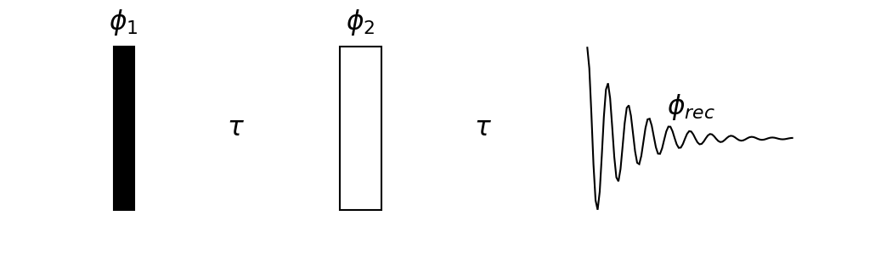
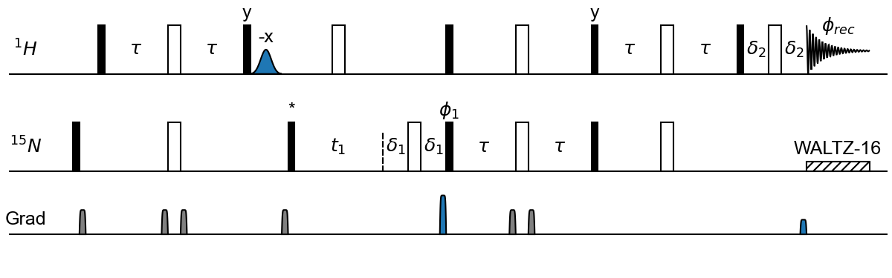
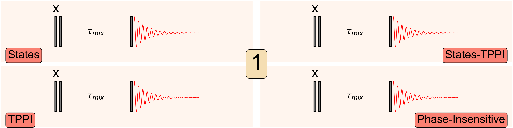
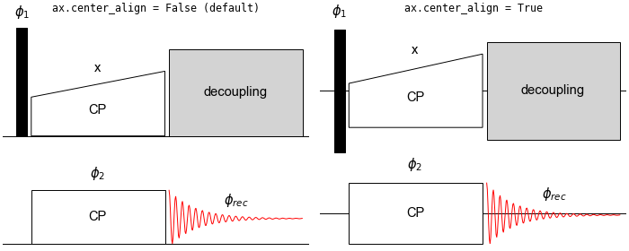

# pulseplot

Tired of opening Inkspace or (*gasp*) Illustrator to make
simple pulse-timing diagrams? Want to combine spectra and 
pulse-timing diagrams on a single plot without having to manually
piece them together? Want an easy way to make shaped pulses, hatches, indicates phases, FIDs, and animation? How about something like this:


```python
import pulseplot as pplot

spin_echo = r"""
p1 ph1 fc=black
d10 tx=$\tau$ 
p2 ph2 
d10 tx=$\tau$  
p10 sp=fid phrec 
"""

fig, ax = pplot.subplots(figsize=(7, 2))
ax.pseq(spin_echo)
fig.savefig("spin_echo.png", dpi=150)
```



Or, maybe something more complicated? 



[See Source](examples/hsqcetgpsi.py)

Perhaps some simple animation?



[See Source](examples/quadrature.py)


# Requirements
1. Python 3.7 or higher
1. Matplotlib 3.3 or higher
1. Numpy


# Installation

1. Using pip

Get the stable version from PyPi using
```
python -m pip install pulseplot
```

Else, you can also get the latest version from GitHub using

```
python -m pip install git+https://github.com/kaustubhmote/pulseplot
```

2. Install from source
```
git clone https://github.com/kaustubhmote/pulseplot
cd pulseplot
[activate your virtual environment]
python -m pip install -r requirements.txt
python -m pip install .
```

# Usage

## The basics

Start with importing the module. 

```python
>>> import pulseplot as pplot

>>> fig, ax = pplot.subplots(nrows=2, ncols=2)
>>> fig, ax = pplot.subplot_mosiac("AB\nCD")
```

`pulseplot` piggy-backs on matplotlib's object-oriented interface. Just like `plt.subplots` (`plt` is short for `matplotlib.pyplot`), the function `pplot.subplots` returns `Figure` and `Axes` objects. It is in fact just a thin wrapper around the `plt.subplots()` call, and passes along all arguments given to it to `plt.subplots`. The only additional thing it does is define some methods on `Axes` that is returned (`ax`), so that it can, among other things, add pulses, delays, track their positions on the horizontal axis, etc. The `ax.pulse` and `ax.delay` methods "apply" pulses and delays with either strings, keyword arguments, or both. The method `pseq` can apply a sequence of these delays and pulses. In addition the wonderful `plt.subplot_mosaic` function (available in matplotlib 3.3 and higher) is available as `pplot.subplot_mosaic`. You also get a `pplot.show()` call for convenience (It just calls plt.show()).

If you instead want to manually add an `Axes` to `Figure` using `fig.add_subplot(...)`, you will first need to register the "PulseProgram" projection.

```python
>>> pplot.register_projection(pplot.PulseProgram)

>>> fig = plt.figure()
>>> ax = fig.add_subplot(111, projection="PulseProgram")
```

## Pulses 

```python
>>> fig, ax = pplot.subplots()

>>> # the following statements are equivalent
>>> ax.pulse(r"p1 pl1 f1")
>>> ax.pulse(plen=1, power=1, channel=1)
>>> ax.pseq(r"p1 pl1 f1") 
>>> ax.pseq(r"p=1 pl=1 f=1")
```
This syntax is "inspired" by the syntax used on Bruker spectrometers. The above statement draws a rectangle (pulse) with length=1 (`p1`), height=1 (`pl1`) starting at x-position that is automatically determined and y-position=1 (`f1`). Optionally, you can declare all variables with "=" for clarity, or as keyword arguments. The following sections just used strings and the `ax.pseq` method.

Note: Always use raw strings (`r"..."`) to avoid issues with escape characters.

## Pulse annotations

```python
>>> ax.pseq(r"p1 pl1 f1 ph1")
>>> ax.pseq(r"p1 pl1 f1 ph_x") 
>>> ax.pseq(r"p1 pl1 f1 ph1 pdy=0.1 pdx=-0.2 pfs=10")
>>> ax.pseq(r"p1 pl1 f1 tx=$\tau$")
>>> ax.pseq(r"p1 pl1 f1 tx=CP tdx=0.1 tdy=-0.1 tfs=20" )
```

The `ph1` declaration (equivalent to `ph=1`) adds a text $\phi_1$ at an automatically calculated location at the top of the pulse. If instead, you want to put in only a label `x`, simply start the text to be put in with an underscore. If you are not happy with the exact location of this label, use `pdx` and `pdy` to move the label from its automatically calculated position, and `pfs` to change its font size. Similarly, a text can be specified by `tx`, and moved around using `tdx` and `tdy` from its default position (which is somewhere in the center of the pulse itself), and `tfs` specifies the font size. In matplotlib, all text inside `$...$` is interpreted as a LATEX block, so you can use it to add Greek letters and mathematical symbols.

The default power for a pulse is 1 and the default channel is 0. These will be used if none are specified.

Pulse length can be zero or negative. A `p0` declaration just adds a vertical line, which can be useful to mark positions. A negative pulse aligns the pulse so that it ends at the current ax.time.


## Delays

```python
>>> # The following statements are equivalent

>>> ax.delay(r"d2 tx$\tau$ tdy0.4 f1")
>>> ax.pseq(r"d2 tx$\tau$ tdy0.4 f1")
```

A delay is just a pulse with no `facecolor`, no `edgecolor`, and the default power level (1.0). You can annotate delays with `ph` and `tx` are declarations, just like that with pulses. Delays can be negative. A negative delay will simply decrease `ax.time` instead of increasing it. 


## Pulse sequence

```python
>>> pH90 = r"p1 pl1 f1 fc=k"
>>> pN180 = r"p2 pl1 f0"

>>> seq = fr"""
# NOESY with pi pulse on 15N
{pH90} ph1
d2
{pN180} # refocus
d2
{pH90} ph2
d5
{pH90} ph3
p10 sp=fid phrec
"""

>>> ax.pseq(seq)
```

`ax.pseq` applies a sequence of pulses/delays, each separated on a new line. Python's multi-line strings (r""" ...  """) can be used to construct these. You can predefine pulses that you want to reuse as strings, and use `f-strings` to construct the pulse-sequence, which can then be fed to `ax.pseq`. Comments can be indicated by a `#`. Anything appearing after a `#` on a line will be ignored. 


## Simultaneous and centered pulses

```python
>>> ax.pseq(r"""
p1 pl1 ph1 f1 w
p1 pl1 ph2 f2 # aligned with the previous pulse
p1 pl1 ph1 f1 c  
""")
```
By default, `ax.time` moves to the end of the pulse/delay after it is applied. Simply add a `w` in the declaration (stands for "wait") to not do so. This is convenient when left aligning two pulses. 

Pulses start at the current `ax.time` by default. Instead, if you want to center a pulse at the current value of `ax.time`, add the declaration `c`. 

## Shaped pulses

```python
>>> ax.pseq(r"p1 pl1 f1 sp=fid")
>>> ax.pulse(r"p1 pl1 ph1 f1", shape=lambda x:x**3)
```
This would not be very useful library without the ability to add shaped pulses. Simply use the `sp=` declaration to give the shape. Currently, the library has these shapes: 

| Name       | Parameters         | Example/Default  | Comment                 |
| -----------|--------------------|------------------| ------------------------|
| `fid`      | frequency, decay   | `fid_10_5`       | Free Induction Decay    |
| `fid2`     | frequency, decay   | `fid2_10_5`      | Noisy FID               |
| `gauss`    | center, sigma      | `gauss_0.5_6`    | Gaussian Pulse          |
| `ramp`     | percent            | `ramp_40`        | Linear Ramp Pulse       |
| `tan`      | percent, curvature | `tan_50_0.1`     | Tangential Ramp Pulse   |
| `grad`     | risetime           | `grad_8`         | Gradient                |
| `sine`     | -                  | `sine`           | Sinusoid (0 to 2$\pi$)  |
| `grad2`    | gives back `sine`  | `grad2`          | Sinusoid (0 to 2$\pi$)  |

---

These shapes are customizable. For example, `r"p1 pl1 sp=ramp_-30"` gives a shape with a linear ramp from 100% to 70% of the specified power level. The parameters for the shapes are given above, and are set in the pulse sequence strings using underscores to separate them. The defaults and allowed parameters for each shape are given above. 

If you need a customized shape, you will need to define it as a function of a single variable (time), and pass the function to the `shape` argument in `ax.pulse`. Python's `lambda functions` comes in very handy here, as shown in the example above, which puts in a 'cube' function as a shape. You can also pass a custom function or a numpy array directly to the pulse sequence string as shown below:

```python

>>> def myshape(x):
        return x ** 2

>>> def myshape_array():
        return np.linspace(0, 1, 100)

>>> ps = r"""p1 pl1 fck
d1
p2 sp2
d1
p3 sp3 
"""
>>> ax.params = {"sp2": myshape, "sp3": myshape_array}
>>> ax.pseq(ps)

```

All pulses are implemented as shapes using the `Polygon` patch in matplotlib. Only the top part of the pulse is the actual shape and vertical lines are drawn by default to the channel so that this looks like a pulse. The vertical lines are not added if `troff` is specified.  All `Polygon` patches, by default, are closed, i.e. the first and last points are joined. This behaviour is changed by the declaration `o` (stands for "open"). The case `sp=fid` and `sp=fid2` is a bit special, in that `troff` and `o` are automatically specified.


### Colors, hatches, and transparency. 

There are several more declarations than can be passed.

```python
>>> # The two statements below are equivalent

>>> ax.pulse(r"p1 pl1 ph1 f1 fc=black ec=red al=0.5 h=///")
>>> ax.pulse(
        r"p1 pl1 ph1 f1", 
        facecolor="black", 
        edgecolor="red", 
        alpha=0.5, 
        hatch="///",
    )
```


### Alignments

If you want your diagrams to look like they appear on an oscilloscope, set the `center_align` attribute on your `Axes` to True.



[See source](examples/cross_polarization.py)


# Animations

We again piggy-back on Matplotlib's `ArtistAnimation` class to make simple animated gifs or mp4 files. This requires that you collect all artists for each frame of your animation separately in a list, and pass this list of lists to the ArtistAnimation class. The simplest way to generate this is use f-strings to make a function to generate a string for your sequence (which is quite handy even if you don't want to make an animation). At each step, collect all the artists (in `pulseplot`, these artists are either patches or text objects, and then replot). Dont forget to reset `ax.time` each time. 

```python
def sequence(time):
    pulse = r"p1 fc=black"
    seq = fr"""
        {pulse}
        d{time} 
        {pulse}
        d2 tx=$\tau$
        {pulse}
        p15 pl1 sp=fid fc=none
        
        """
    return seq

fig, ax = pplot.subplots(figsize=(7, 1), dpi=300)
ax.spacing = 0.1

parts = []
for i in range(10):
    ax.time = 0
    ax.pseq(sequence(i))
    ax.draw_channels(0)
    
    if i == 0:
        npatches, ntexts = len(ax.patches), len(ax.texts)

    parts.append(ax.patches[-npatches:] + ax.texts[-ntexts:])
    
two_dim = pplot.animation(
    fig, 
    parts, 
    interval=1000, 
)

two_dim.save("two_d.gif")
```
The above example assumes that the number of patches and texts don't change in any of the frames. If this is not correct, you need to track the number of patches/text in each iteration, and only add the ones you want to.


## Bugs and requests

Just open an issue or a pull-request.
